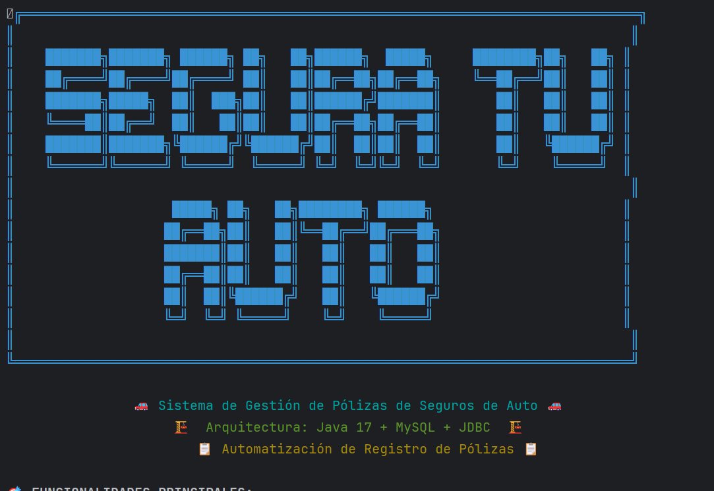
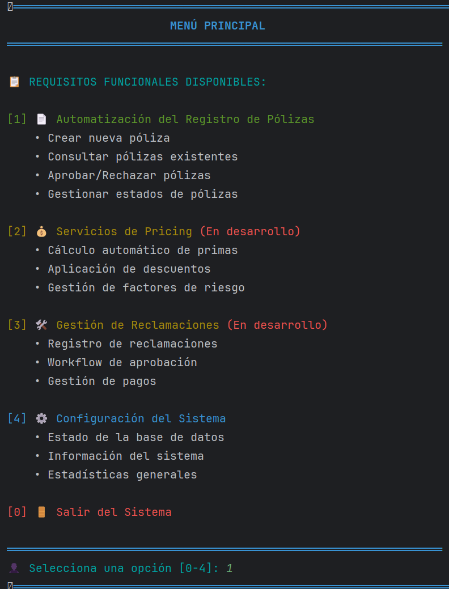
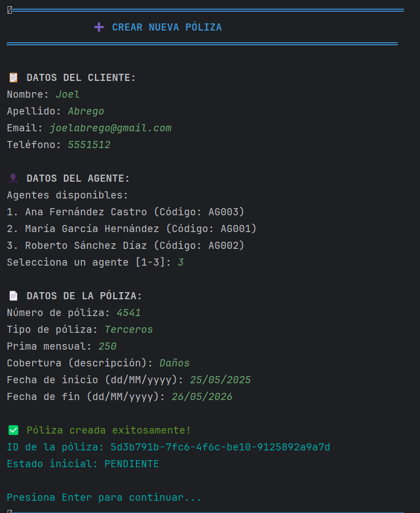
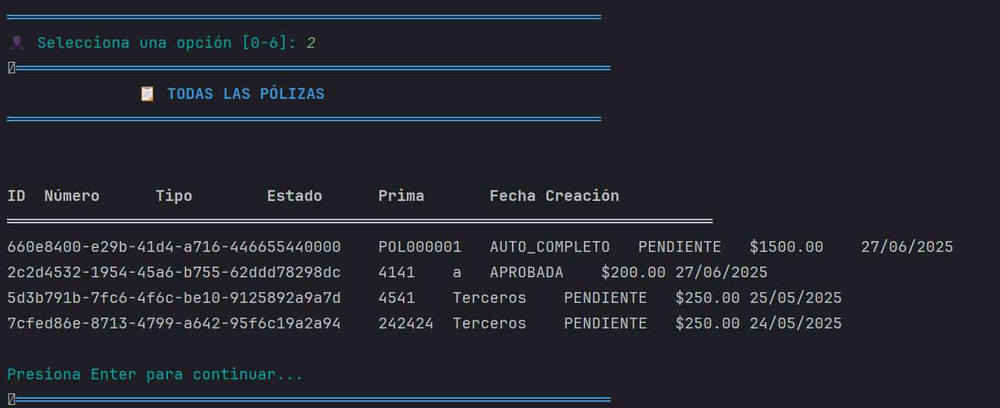
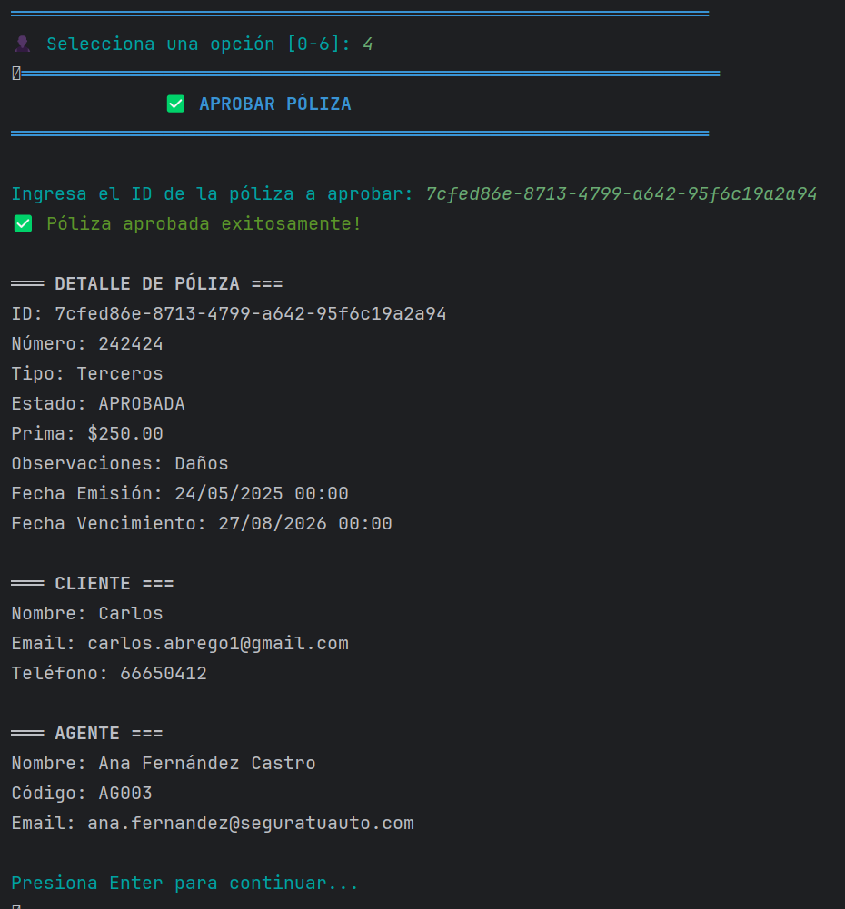
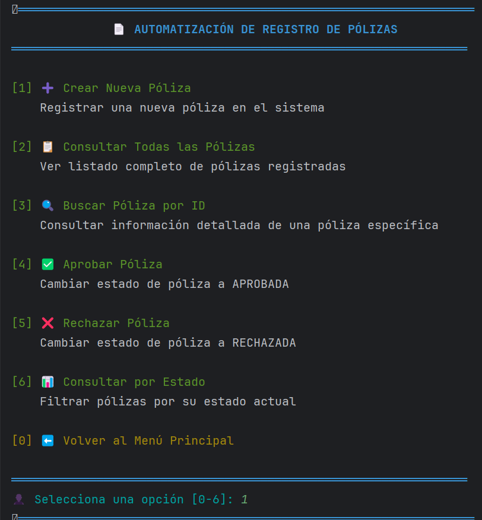
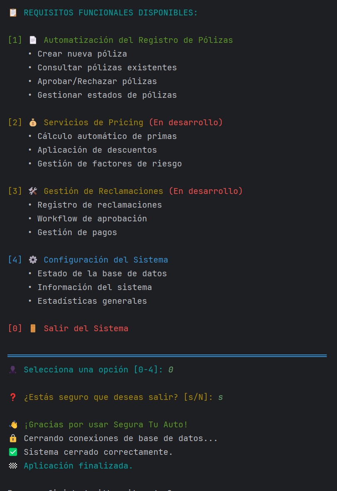

# Explicación del Contenido de las Capturas - Sistema Segura Tu Auto

Este documento explica el contenido funcional mostrado en cada captura del sistema de automatización de pólizas de seguros.

## start_system.png - Inicio del Sistema

**Contenido funcional:**

- Muestra la pantalla de carga inicial de la aplicación.
- Indica que el sistema se está inicializando y preparando para su uso.

## menu_system.png - Menú Principal del Sistema

**Contenido funcional:**

- Pantalla de inicio de la aplicación de consola.
- Menú principal con opciones para gestionar pólizas, clientes y agentes.
- Punto de entrada para todas las funcionalidades del sistema.

## poliza_creada.png - Proceso de Creación de Nueva Póliza

**Contenido funcional:**

- Formulario de registro de nueva póliza (RF-001).
- Captura de datos del cliente y detalles de la póliza.
- Asignación automática de estado inicial "PENDIENTE".
- Confirmación de que la póliza ha sido creada exitosamente.

## table_poliza.png - Consulta de Todas las Pólizas

**Contenido funcional:**

- Listado completo de pólizas registradas en el sistema (RF-003).
- Información tabular con: ID, Número de Póliza, Tipo, Estado, Prima, y Fechas.
- Vista general del estado del sistema y la cantidad de pólizas registradas.

## poliza_aprobada.png - Aprobación de Pólizas

**Contenido funcional:**

- Proceso de cambio de estado de una póliza (RF-002).
- Selección de una póliza por su ID para la aprobación.
- Cambio de estado de "PENDIENTE" a "APROBADA".
- Confirmación de la operación de aprobación.

## menu_poliza.png - Menú de Gestión de Pólizas

**Contenido funcional:**

- Submenú dedicado a la gestión de pólizas.
- Opciones para crear, consultar, actualizar y eliminar pólizas.
- Permite filtrar pólizas por estado.

## fin_system.png - Fin del Sistema

**Contenido funcional:**

- Muestra el mensaje de despedida al usuario.
- Indica que la aplicación ha finalizado su ejecución de manera correcta.

## Requisitos Funcionales Demostrados

### RF-001: Automatización del Registro de Pólizas

- Creación de nuevas pólizas con validación de datos.
- Registro automático de clientes.
- Asignación de agentes y generación de IDs.

### RF-002: Gestión de Estados de Pólizas

- Consulta de pólizas por estado.
- Aprobación de pólizas pendientes.
- Rechazo de pólizas pendientes.
- Historial de cambios con fechas.

### RF-003: Consulta y Búsqueda de Pólizas

- Lista completa de pólizas.
- Búsqueda específica por ID.
- Información detallada de pólizas, clientes y agentes.

### RF-004: Gestión de Clientes y Agentes

- Registro de nuevos clientes durante la creación de la póliza.
- Vinculación automática de relaciones cliente-agente-póliza.

## Flujo de Trabajo Demostrado

1.  **Ingreso al sistema** → Menú principal.
2.  **Creación de póliza** → Registro de datos → Estado PENDIENTE.
3.  **Consulta de pólizas** → Revisión de estados.
4.  **Gestión de estados** → Aprobación o rechazo.
5.  **Seguimiento** → Consultas por estado y búsquedas específicas.
